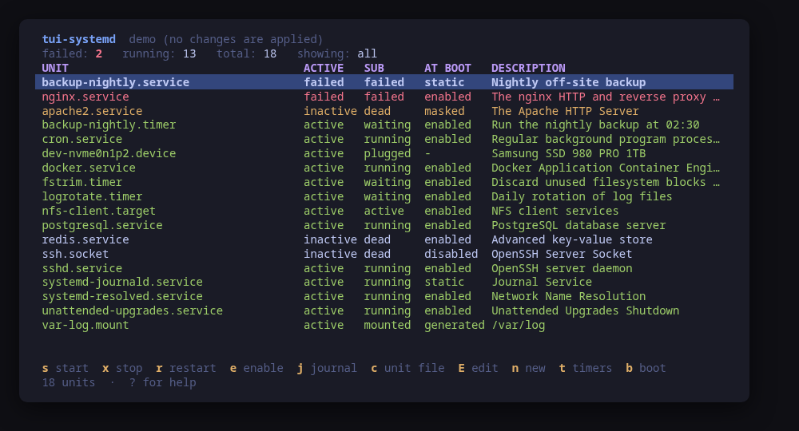
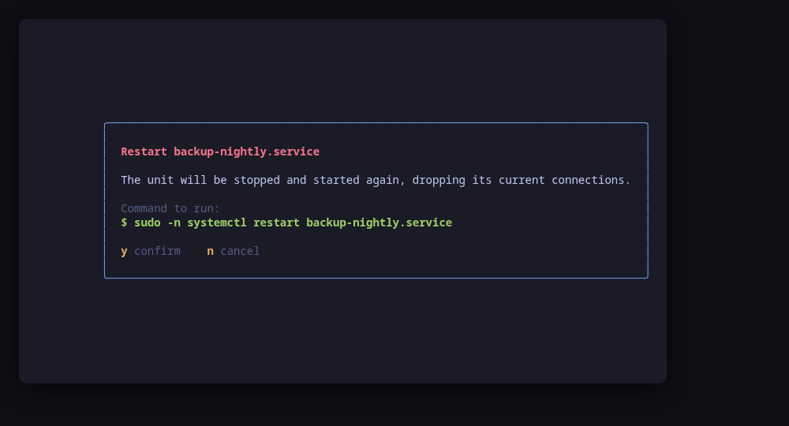
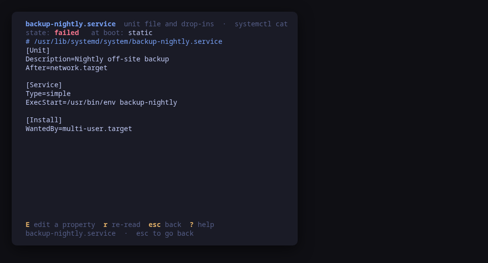
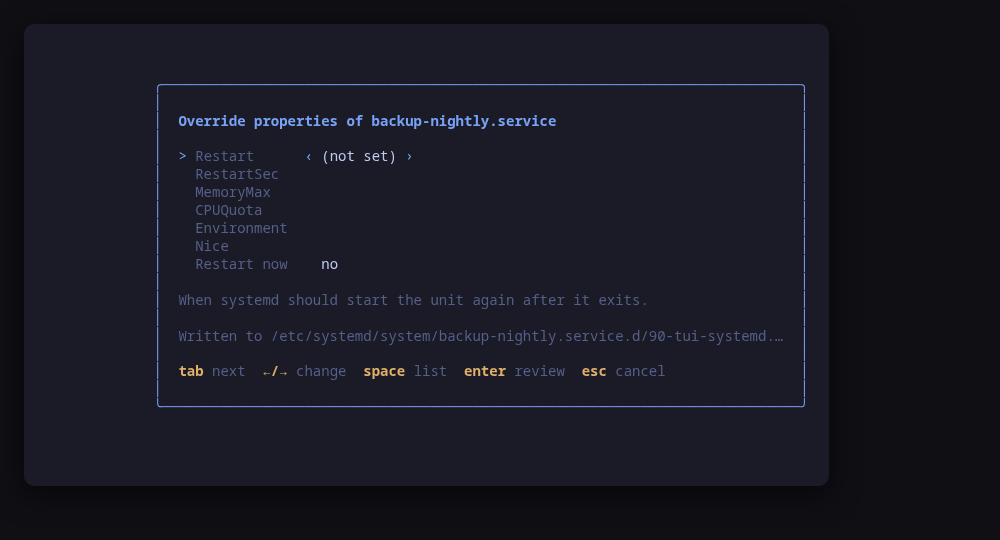
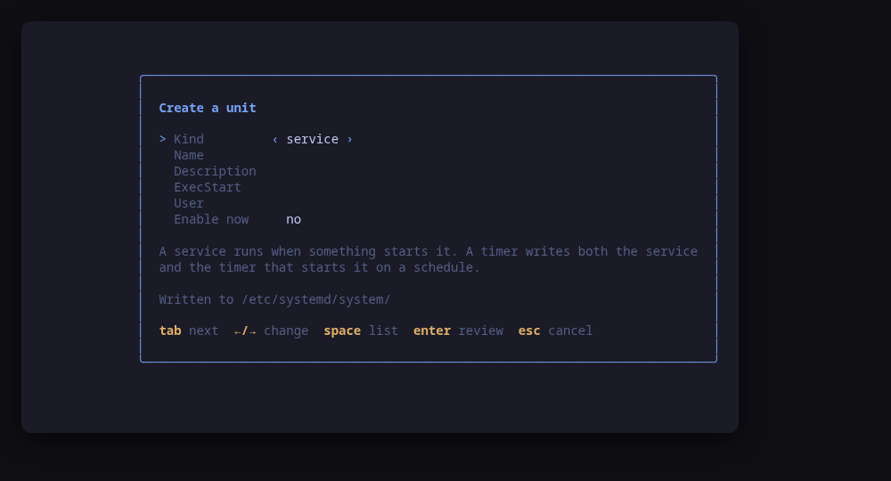
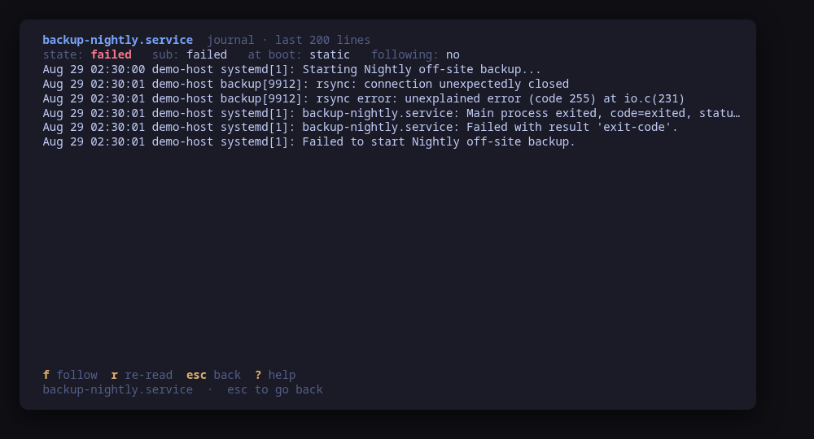
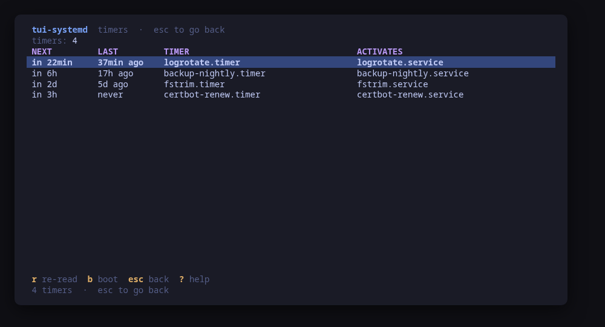
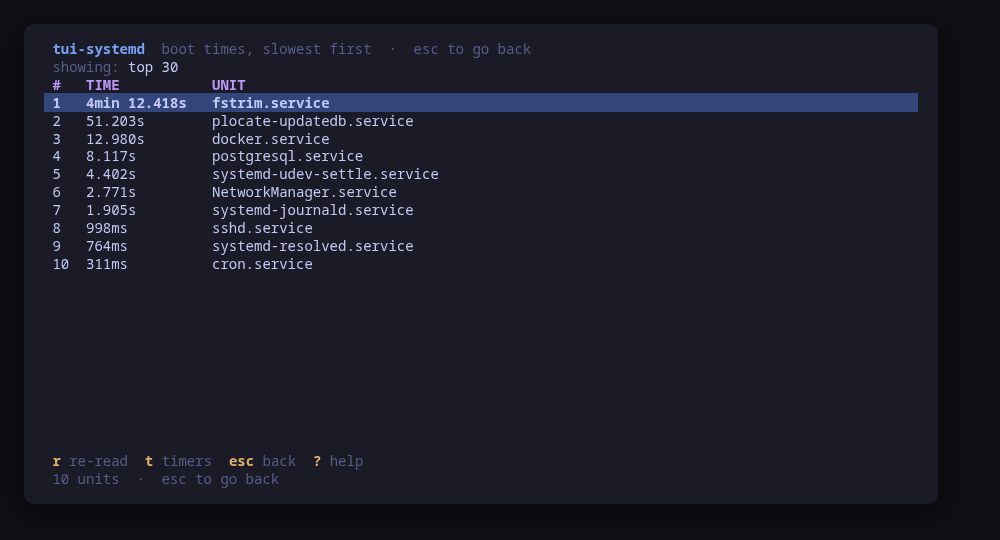
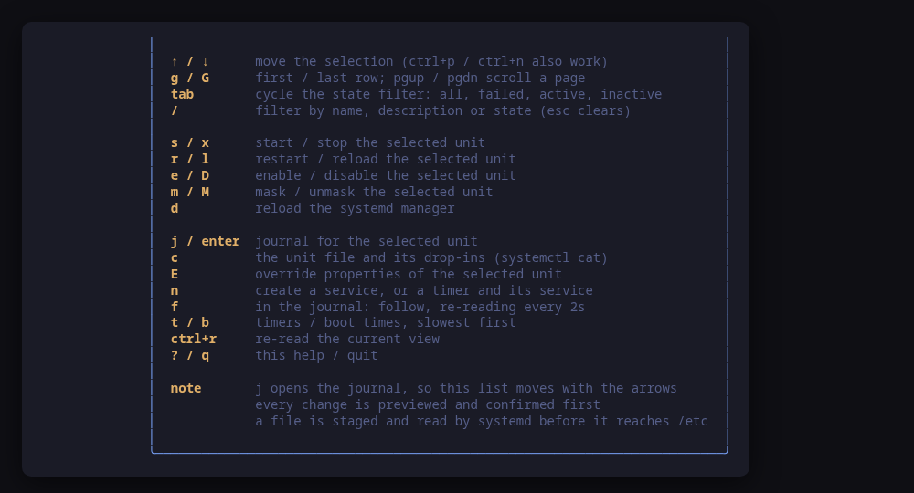

[](https://scorecard.dev/viewer/?uri=github.com/tui-tools/tui-systemd)
[](https://www.bestpractices.dev/projects/14368)

> **Beta.** The family is days old and still changing. Package names, flags
> and keys may move without notice until 1.0. Pin versions, and report what
> breaks.

A terminal UI for systemd units. It opens on what failed, shows you the journal
that explains why, writes the drop-in or the unit file you need, and **previews
the exact command line of every change before running it**.



> **Status: early, under validation.** An independent tool that follows the
> [Omarchy](https://omarchy.org) visual style; it is **not** part of the Omarchy
> project and not endorsed by its maintainers. Expect rough edges.

## Install

<!-- install:start -->
<!-- Generated by tui-kit/tools/render-install.py from tool.json. -->
<!-- Edit the manifest, then run `make readme`. -->

### Arch Linux

Needs the tui-tools repository, which is a [one-time
setup](https://tui-tools.github.io/install/).

The one-liner detects the distribution and adds the repository and its signing
key:

```sh
curl -fsSL https://pkgs.tui.tools/install.sh | sh
```

Piping a script into a shell is not this family's style, so here is the same
setup by hand — read it, or read the script first with `curl -fsSL
https://pkgs.tui.tools/install.sh -o install.sh`:

```sh
curl -fsSL -o /tmp/tui-tools.asc https://pkgs.tui.tools/pubkey.asc
sudo pacman-key --add /tmp/tui-tools.asc
sudo pacman-key --lsign-key \
  "$(gpg --show-keys --with-colons /tmp/tui-tools.asc | awk -F: '/^fpr:/{print $10; exit}')"
printf '[tui-tools]\nServer = https://pkgs.tui.tools/arch/$arch\n' \
  | sudo tee -a /etc/pacman.conf
sudo pacman -Sy
```

Then, and for every other tool in the family:

```sh
sudo pacman -S tui-systemd
```

Upgrades then arrive with the rest of your system updates.

### Debian and Ubuntu

Needs the tui-tools repository, which is a [one-time
setup](https://tui-tools.github.io/install/).

The one-liner detects the distribution and adds the repository and its signing
key:

```sh
curl -fsSL https://pkgs.tui.tools/install.sh | sh
```

Piping a script into a shell is not this family's style, so here is the same
setup by hand — read it, or read the script first with `curl -fsSL
https://pkgs.tui.tools/install.sh -o install.sh`:

```sh
sudo install -d -m 0755 /etc/apt/keyrings
curl -fsSL https://pkgs.tui.tools/pubkey.asc \
  | sudo gpg --dearmor -o /etc/apt/keyrings/tui-tools.gpg
echo "deb [signed-by=/etc/apt/keyrings/tui-tools.gpg] https://pkgs.tui.tools/deb stable main" \
  | sudo tee /etc/apt/sources.list.d/tui-tools.list
sudo apt update
```

Then, and for every other tool in the family:

```sh
sudo apt install tui-systemd
```

Upgrades then arrive with the rest of your system updates.

### Fedora and RHEL

Needs the tui-tools repository, which is a [one-time
setup](https://tui-tools.github.io/install/).

The one-liner detects the distribution and adds the repository and its signing
key:

```sh
curl -fsSL https://pkgs.tui.tools/install.sh | sh
```

Piping a script into a shell is not this family's style, so here is the same
setup by hand — read it, or read the script first with `curl -fsSL
https://pkgs.tui.tools/install.sh -o install.sh`:

```sh
sudo rpm --import https://pkgs.tui.tools/pubkey.asc
sudo curl -fsSL -o /etc/yum.repos.d/tui-tools.repo https://pkgs.tui.tools/rpm/tui-tools.repo
sudo dnf makecache
```

Then, and for every other tool in the family:

```sh
sudo dnf install tui-systemd
```

Upgrades then arrive with the rest of your system updates.

### Any distribution, static binary

```sh
curl -fsSL https://github.com/tui-tools/tui-systemd/releases/download/v0.1.2/tui-systemd_0.1.2_linux_amd64.tar.gz | tar -xz tui-systemd
sudo install -m0755 tui-systemd /usr/local/bin/tui-systemd
```

One static binary. Verify it against checksums.txt from the same release.

### From source

```sh
git clone https://github.com/tui-tools/tui-systemd
cd tui-systemd && make build
sudo install -m0755 bin/tui-systemd /usr/local/bin/tui-systemd
```

Needs Go 1.26 or newer.

Not packaged for these yet; the static binary works everywhere in the meantime.

### Arch Linux (AUR) — coming soon

```sh
paru -S tui-systemd-bin
```

The -bin package installs the released static binary.

### openSUSE — coming soon

Needs the tui-tools repository, which is a [one-time
setup](https://tui-tools.github.io/install/).

```sh
sudo zypper install tui-systemd
```

The rpm repository is shared with dnf; zypper support is not tested yet.

### Verify a download

Every release of `tui-systemd` ships a `checksums.txt`. Check an archive
against it before installing:

```sh
sha256sum -c checksums.txt --ignore-missing
```
<!-- install:end -->

One static binary, no daemon, no state of its own.

## Try it without root

```sh
tui-systemd --demo
```

`--demo` runs against a sample machine with a couple of interesting failures.
Every key works, every command is built and previewed for real, and nothing
touches your system.

## `--check`, for scripts and tests

`--check` is the non-interactive read path: it reads the machine through the
same backend the UI would use, prints the parsed model as JSON and exits 0, or
exits 1 with the reason if systemd cannot be read. No UI, and it never builds or
runs an action, so it is safe to run anywhere.

```console
$ tui-systemd --check | head -10
{
  "tool": "tui-systemd",
  "version": "0.1.0",
  "backend": "systemd",
  "describe": "systemctl via /usr/bin/sudo -n",
  "units": 543,
  "active": 272,
  "failed": 0,
  "enabled": 85,
  "timers": 20,
```

Alongside the counts it carries a five-unit sample and the result of one real
journal read, so a single invocation covers `list-units`, `list-unit-files`,
`list-timers`, `systemd-analyze blame` and `journalctl`. It exists so a test can
assert on what the tool *parsed* rather than on what it painted — for instance
that the active-unit count matches `systemctl`'s own, which is what catches a
parser regression.

[tui-lab](https://github.com/tui-tools/tui-lab) uses it to test this tool
against real machines on Ubuntu, Fedora and Omarchy Server; the assertions live
in [`test/smoke.sh`](test/smoke.sh).

## `--report`, for bug reports

```sh
tui-systemd --report
```

`--report` prints, in one block, everything a maintainer has to ask for
otherwise: the tool and kit versions, the systemd version probed off the
machine, whether `journalctl` and `systemd-analyze` are installed, the
distribution, the kernel, the terminal, the theme, the escalation prefix, the
journal backlog the log panel asks for, and whether the running binary came
from a package. It needs no privileges and reads no units, so it works on the
machine where the bug is — including one where no backend can be selected at
all, which is itself a thing worth reporting.

```console
$ tui-systemd --report
tui-systemd 0.1.0 (kit v0.2.9)
backend: systemd 257
mode: live
distro: fedora 42 (Fedora Linux 42 (Workstation Edition))
kernel: 6.19.14-108.fc42.x86_64
arch: x86_64
locale: en_US.UTF-8
term: xterm-256color
theme: tokyo-night
sudo: sudo -n
root: no
binary: /usr/bin/tui-systemd (packaged)
helpers: journalctl present, systemd-analyze present
journal lines: 200
```

The block is written to be published as it is: it carries no hostname, user
name, home path or address, and no environment variable beyond `LANG`,
`LC_ALL`, `TERM` and `TERM_PROGRAM`. A binary living under your home directory
is reported as being there without naming the path. `--report` works with
`--demo` too, where it says so on the `mode` line.

The bug form asks for this block first — see
[`.github/ISSUE_TEMPLATE/bug_report.yml`](.github/ISSUE_TEMPLATE/bug_report.yml).

## It runs as you

Reading needs no privileges at all: the unit list, the journal, the timers and
the boot breakdown all work as an ordinary user, so the tool opens instantly and
without a password. Only an action escalates, through `sudo -n`, which never
prompts — run `sudo -v` in another terminal first, or start `tui-systemd` with
sudo.

## Every change is previewed



`y` runs the command shown, `n` does not. There is no other path to a change:
the UI hands the same value to the preview and to the runner, so what you read
is what executes.

## Writing unit files

`c` shows the unit as systemd assembles it — the fragment and every drop-in,
each named by its path, which is the only honest answer to "where is this
property set".



`E` opens a guided editor over a **closed set of properties**: `Restart`,
`RestartSec`, `MemoryMax`, `CPUQuota`, `Environment`, `Nice`, and `OnCalendar`
on a timer. Each is offered with the values systemd accepts — a list where the
value is a choice, a checked pattern where it is not — so a typo cannot reach
`/etc`. The editor writes one file and rewrites it whole:

    /etc/systemd/system/<unit>.d/90-tui-systemd.conf



`n` creates a unit from a vetted template: a service, or a timer and the
service it starts. The program in `ExecStart` must be an absolute path, and
**an existing unit is never overwritten** — edit that one with `E` instead.



Both take the same road to disk, and it is the one thing to understand about
this feature:

1. **Render** the whole file. Nothing is appended, so a property can never end
   up in the file twice with systemd quietly taking the last one.
2. **Stage** it in a private temporary directory, beside a copy of everything
   systemd reads for that unit — the fragment, and the drop-ins somebody else
   shipped.
3. **Check** it with `systemd-analyze verify`, before you are asked anything.
   `verify` warns about a value it cannot parse and still exits 0, so any
   output at all counts as a refusal: a line systemd would silently ignore is a
   line you thought you were setting.
4. **Review** the unified diff and the exact command lines.
5. **Install** with `install -m 644` — the mode is set in the same call, so
   there is no window where the file exists with the wrong one — and
   `systemctl daemon-reload`.

Restarting the unit afterwards, or `enable --now` on a unit you just created,
is a **second confirmation**: writing a file and taking a service down are
different decisions, and they are asked separately.

Under `--demo` the whole flow works against the sample machine, with the same
command lines, and says plainly that the file was not checked — the demo does
not run `systemd-analyze`, and it does not pretend to.

## The journal, where you already are

Press `j` on a unit to read its log without leaving the tool. `f` follows it,
re-reading every two seconds — a re-read on a timer rather than a `journalctl -f`
child process, because this tool keeps nothing running.



## Timers and boot

`t` shows what is scheduled and when it last fired. `b` shows what made the last
boot slow.





## Keys

| Key | Action |
| --- | --- |
| `↑` / `↓` | Move the selection (`ctrl+p` / `ctrl+n` also work) |
| `g` / `G` | First / last row |
| `pgup` / `pgdn` | Scroll a page |
| `tab` | Cycle the state filter: all, failed, active, inactive |
| `/` | Filter by name, description or state (`esc` clears) |
| `s` / `x` | Start / stop the selected unit |
| `r` / `l` | Restart / reload the selected unit |
| `e` / `D` | Enable / disable the selected unit |
| `m` / `M` | Mask / unmask the selected unit |
| `d` | Reload the systemd manager (`daemon-reload`) |
| `j` / `enter` | Journal for the selected unit |
| `c` | Show the unit file and its drop-ins (`systemctl cat`) |
| `E` | Override properties of the selected unit in a drop-in |
| `n` | Create a service, or a timer and the service it starts |
| `f` | In the journal: follow, re-reading every 2s |
| `t` | Timers |
| `b` | Boot times, slowest first |
| `ctrl+r` | Re-read the current view |
| `?` | Help |
| `q` | Quit |

**`j` opens the journal, so the list moves with the arrows rather than with
`j`/`k`.** That is the one place this tool breaks with the family's vim-style
navigation: `j` for journal is worth more here than `j` for down, and `k`,
`ctrl+n` and `ctrl+p` still work.



## What v0.1 can do

- List every unit systemd knows, merged from `list-units --all` and
  `list-unit-files`, so a unit that is installed but has never started is
  visible too.
- **Failed units sort first**, always. That is why you opened the tool.
- Filter by state (`tab`) and by text across the name, the description and
  every state field (`/`).
- Start, stop, restart, reload, enable, disable, mask and unmask a unit, and
  reload the systemd manager, each behind a command preview and a confirmation.
- Read a unit's journal, and follow it.
- Show the unit file and its drop-ins (`c`).
- Override a closed set of properties through a generated drop-in (`E`), and
  create a service or a timer from a template (`n`) — each staged, checked with
  `systemd-analyze verify`, diffed and confirmed before anything is installed.
- List timers with when they fire next and when they last fired.
- Show the slowest units of the last boot.
- Follow the active Omarchy theme, and respect `NO_COLOR`.

## What v0.1 cannot do

- **System units only.** No `--user` scope yet.
- **No free-text unit editing.** The drop-in editor covers seven properties and
  the templates cover a service and a timer; anything else is still `systemctl
  edit` in `$EDITOR`.
- **No deleting.** A unit this tool wrote is removed with `rm` and a
  `daemon-reload`, deliberately: this tool creates and edits, it does not
  delete.
- **No dependency tree**, no `systemd-analyze critical-chain` or plots.
- **No live status detail** beyond the journal: no cgroup, no main PID, no
  memory or task counts.
- No `--now` combinations from the action keys: enable and start stay separate
  keys with separate confirmations. A unit you just created is the one place
  `enable --now` is offered, as its own second confirmation.
- The journal is read-only and unfiltered; there is no priority or time filter.
- **The timers view needs systemd 250 or newer**, which is when
  `list-timers --output=json` landed. The unit list works on older systemd.

## Compatibility

<!-- compat:start -->
<!-- Generated by tui-kit/tools/render-compat.py from tool.json. -->
<!-- Edit the manifest, then run `make readme`. -->

`tui-systemd` probes its backend once at startup and shows the version in the
header. A version nobody has tested is marked `(untested)` there rather than
hidden; one below the minimum is marked as such and the tool still runs.

### systemd

| | |
| --- | --- |
| Binary | `systemctl` |
| Version read with | `systemctl --version` |
| Minimum | 230 |
| Tested | `255`, `259`, `261` |
| Version-gated features | `timers` (since 250), `boot-blame` (since 230) |

| Versions | What changes |
| --- | --- |
| `<250` | `list-timers` has no JSON output, so the timers view is not offered: the text table cannot be parsed without mangling its timestamps |
| `<245` | `list-units --plain` is absent on some builds, so the unit list falls back to the decorated output |

The tested versions are generated from `compat/results.jsonl`, which the tool's
own smoke test appends to when it runs against a real machine in
[tui-lab](https://github.com/tui-tools/tui-lab).
<!-- compat:end -->

## Configuration

`/etc/tui-systemd/config.toml`, then `~/.config/tui-systemd/config.toml` (the
user file overrides the machine-wide one), then `TUI_SYSTEMD_*` in the
environment. Flags override everything. See
[`examples/config.toml`](examples/config.toml).

```toml
# Privilege escalation prefix used for actions; "" runs systemctl directly.
sudo = "sudo -n"

# Path to an Omarchy-style colors.toml; empty follows the active theme.
theme = ""

# How many journal lines the log panel asks for.
journal_lines = "200"
```

## Theme

The default palette is **Tokyo Night**. On Omarchy, the tool reads the active
desktop theme from `~/.config/omarchy/current/theme/colors.toml` and follows it.
`TUI_THEME` or `--theme` override; `NO_COLOR` drops color and keeps layout. The
rules live in [tui-kit](https://github.com/tui-tools/tui-kit#theme-rules).

## Architecture

The UI never assembles a `systemctl` command line. It talks to
`internal/systemd.Backend`, which returns a plain model and produces
`runner.Command` values for anything that changes the machine. Those are shown
in the confirm dialog and handed back to the
[kit runner](https://github.com/tui-tools/tui-kit#the-contract-preview-confirm-run),
which resolves the binary and the privilege prefix.

Four binaries are involved, each with its own runner and its own failure
message: `systemctl` for the list, the actions and `cat`; `journalctl` for the
log panel; `systemd-analyze` for the boot view and for the syntax check; and
`install` for putting a staged file in `/etc/systemd/system`. Only `systemctl`
and `install` escalate, and only to change something — the syntax check is a
read, and a check that needed a password would be a check nobody ran. A host
missing `journalctl`, `systemd-analyze` or `install` still gets the unit list,
and the affected view says what is missing.

The file-writing path is ported from
[tui-ssh](https://github.com/tui-tools/tui-ssh), which edits `sshd_config` the
same way: render, stage, let the daemon's own parser read it, install, reload.
The two tools show a file change identically on purpose.

Both list readers use `--output=json` rather than the text tables. The tables
are column-aligned, truncate to the terminal width and right-align their time
columns against narrower headers — none of that is a contract, and a parser
that quietly mangles a timestamp is worse than one that fails.

## Prior art

- [systemctl-tui](https://github.com/rgwood/systemctl-tui) (Rust, MIT) — fast,
  focused, and the closest thing to this tool.
- [isd](https://github.com/isd-project/isd) (Python, Textual) — richer, with
  unit file editing and a preview pane.
- [sysz](https://github.com/joehillen/sysz) (shell + fzf) — an fzf front end to
  `systemctl`, and the smallest thing that works.

`tui-systemd` is an independent implementation. What it adds is the family's
contract: every mutation is previewed as the literal command line and confirmed
before it runs, and the same binary drives a sample machine under `--demo`.

## Development

```sh
make check        # gofmt, go vet and the tests: what CI runs
make test
make build
make demo
make screenshots  # re-render the frames above from --demo
```

The parsers are table-driven against real `systemctl` output. If one is wrong on
your machine, paste your output in as a new case — that is the fastest possible
bug report.

Each of them also carries a Go native fuzz target seeded from those same
samples. `go test` replays the seeds on every commit; exploring past them is a
thing you run, one target at a time:

```sh
go test -run=^$ -fuzz=FuzzParseBlame -fuzztime=5m ./internal/systemd/
```

A crash writes its input under `internal/systemd/testdata/fuzz/`, and that file
is committed so the bug cannot come back quietly.

## Safety notes

- **Masking is not disabling.** A masked unit cannot be started by anything,
  including its own dependencies. The confirm dialog says so; `M` undoes it.
- Stopping a unit stops everything that depends on it. systemd does not ask
  twice, and neither does this tool beyond its one confirmation.
- The tool re-reads the unit list after every change, so what you see is what
  systemd reports, not what the tool assumed.
- **A drop-in is world-readable**, like every unit file. `Environment=` is
  there for a log level, not for a password or a token — point the unit at a
  file with `EnvironmentFile=` for those.
- The editor refuses a **masked** unit (a drop-in for it is read by nothing)
  and a **transient** one (it lives in `/run` and disappears with the manager
  that made it).
- `daemon-reload` makes systemd read the new file; it does not make a running
  unit adopt it. That is what the restart step is for, and it says so.

## Contributing

Contributions arrive as pull requests: the flow, and the bar a change has to
clear, are in the family's
[CONTRIBUTING.md](https://github.com/tui-tools/tui-kit/blob/main/CONTRIBUTING.md).
A vulnerability is reported privately instead, the way
[SECURITY.md](https://github.com/tui-tools/tui-kit/blob/main/SECURITY.md)
describes, and never in a public issue.

## License

MIT — see [LICENSE](LICENSE). Part of the
[tui-tools](https://github.com/tui-tools) family.
